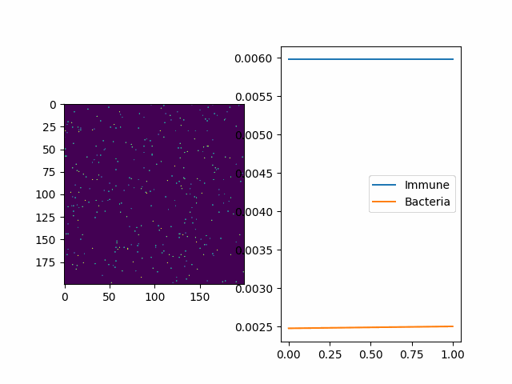
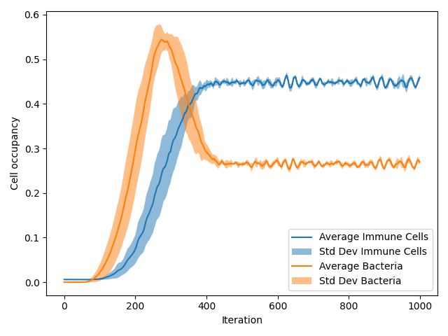
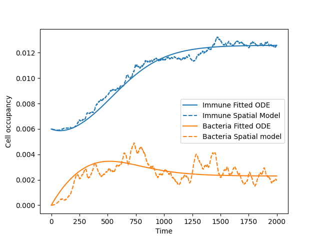
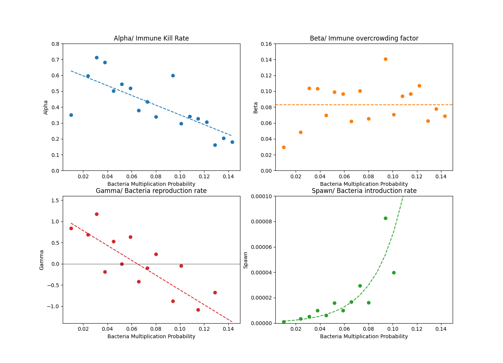

# Group 10: Modeling the resilience of the immune response against bacterial infections
This project contains  spatial model for a bacteria-immunecell system based on a 2D stochastic automaton with an accompanying 

By Anton Dolganov, Peter Hajo Groen, Bálint Szarvas and Sacha Gijsbers

---

## Table of contents
* [Model Overview](#Model-overview)
    * [Bacterial Immune Model](#bacterial-immune-model)
    * [Visualizer](#visualizer)
* [Analytical Tools](#analytical-tools)
    * [tool_paralelRun.py](#tool_paralelrunpy)
    * [tool_fit_ODE.py](#tool_fit_odepy)
    * [Tool_ODE_batch.py](#tool_ode_batchpy)
    * [Tool_plot_ODE_batch.py](#tool_plot_ode_batchpy)

## Model overview
The bacterial immune model consists of two classes found under model.classes, being the model itself, 
as well as a built in visualizer.

### Bacterial Immune model
A simplified 2D spatial model of the local immune system in a sample of tissue with constant introduction 
of new pathogens. Immune cells attempt to kill bacteria and multiply if succesful, while bacteria attempt
to multiply into their direct Moore neighborhood. If there are no bacterial cells in the vicinity of
an immune cell and the density of immune cells in one place is bigger than a set amount, the immune cell dies.

#### Initialization parameters
| Parameter             | Explaination                                          |
|-----------------------|-------------------------------------------------------|
| length (int)          | Length of the lattice.                                |
| width (int)           | Width of the lattice.                                 |
| pImmuneKill (float)   | Chance an immune cell kills a bacteria cell.          |
| pbacteriaMult (float) | Chance a bacteria cell multiplies every timestep.     |
| pbacteriaSpawn (float)| Chance a normal cell becomes bacteriaous per timestep.|

#### Quick Implementation Guide
If one wants to implement the model into their own project as is, the following steps should be taken.
1. Initialize a new `BacteriaImmuneModel` object with the above parameters.
2. (optional) Seed the model with an initial population of bacterial cells for the desired amound of 
   cells nCells using `BacteriaImmuneModel.seedBacteria(nCells: int)`
3. Seed the model with an initial population of immune cells for the desired amount of cells nCells 
   using `BacteriaImmuneModel.seedImmune(nCells: int)`
4. Call `BacteriaImmuneModel.timestep()` to update the lattice. The current populations of immunecells 
   and bacterial cells can be obtained using `BacteriaImmuneModel.get_nImmuneCells()` and 
   `BacteriaImmuneModel.get_nbacteriaCells()` respectively

for more information, see `/model/classes/bacterialImmuneModel.py`

### Visualizer
A real time visualizer class for the bacterial immune model that shows that displays the 2D lattice 
of the model, as well as current values for the cell occupancies.

Initialize object, then call Visualizer.run()

#### Initialization parameters
| Parameter                 | Explaination                                          |
|---------------------------|-------------------------------------------------------|
| model(BacteriaImmuneModel)| The model to be visualized                            |

#### Example
When the visualizer is ran, two plots are shown, with on the left the lattice visualization and on the right the cell occupancies.
The lattice visualization shows immune cells as yellow and bacterial cells as blue, with the blue background representing the other cells of the tissue (See below).

## Analytical tools
In order to obtain results, some tool programs were developed, which are explained below.
### tool_paralelRun.py
Parallel running program for Bacteria immune model.

#### Usage
To plot an earlier result, run the program like 
`python tools_paralelRun.py p [FILEPATH] [PLOTNAME: optional]`
* FILEPATH   - Path of the exported CSV file.
* PLOTNAME   - Title for the plotted image
        
To run an experiment with default settings, run the program like
`python tools_paralelRun.py`

To run a new experiment, run the program like
`python tools_paralelRun.py [RUNS: int] [ITERATIONS: int] [PROCESSES: int] [KWARGS]`
or as
`python paralelRun.py [KWARGS]`
* RUNS       - The amount of runs to take average of
* ITERATIONS - The maximum amount of iterations for a single run
* PROCESSES  - The amount of parallel processes to run
* KWARGS     - Keyword arguments (see below)

#### Keyword arguments
Relevant arguments are presented in a list format, where every list item is associated with the same
parameter.

#### case insensitive
`["filename", "fn", "name", "n"]=(int)`
- Filename for the resultFile
        
`["runs", "r"]=(int)`
- The amount of runs to take average of.
        
`["maxiter", "iter", "iterations", "i"]=(int)`
- The maximum amount of iterations for a single run.
        
`["processes", "proc", "p"]=(int)`
- The amount of parallel processes to run.
        
`["boxl", "boxlen", "bl", "boxlenght"]=(int)`
- The length of the modelled square box.
        
`["immunefraction", "fractionimmune","immunefrac", "if", "frac", "f"]=(float)`
- The fraction of cells to be occupied by immune cells in the initial state of the model.
        
`["noplot"]=(bool)`
- disable plotting of results afterwards
        
#### case sensitive model parameters:
`pImmuneKill=(float/list[float])`
- The chance an immune cell kills a bacteria cell it occupies the same cell as.

`pBacteriaMultiply=(float/list[float])`
- The chance a bacteria cell multiplies.

`pBacteriaSpawn=(float/list[float])`
- The chance a bacteria cell spawns on the grid.

A list structure can also be entered, which makes the program loop through all possible combinations 
of these parameters.

#### Example data plot

### tool_fit_ODE.py
Fits input guess parameters to data from spatial ODE and prints fitted parameters to console.

#### Partial Differential Equations
$${dI\over dt}= \alpha BI - \beta I^2$$
$${dB\over dt}= \gamma B^2 - \alpha BI + Spawn$$

- $I =$ Immune Cell population
- $B =$ Bacteria Cell population
- $\alpha=$ immunecell killRate
- $\beta =$ immunecell overcrowding
- $\gamma =$ bacterial growthrate
- $Spawn =$ Bacterial spawnrate

#### Usage
`python ./tool_fit_ODE [filename] [xGuess] [plotGuess]`

- filename : Filename or filepath to resultfile relative from active user folder.
- xGuess   : Guess parameters for ODE fit, formatted like stock python list  of four elements
             between quotes.
             Example: `"[0.1, 0.1, 0.1, 0.1]"`
- plotGuess: Bool like string of whether the input guess should be plotted to the input file data 
             without fitting.
             Example: `True`, `False`

### Example Plot

### tool_ODE_batch.py
Has variable pBacteriaMult, and fixed ImmuneKill and pBacteriaSpawn parameters
Places files in ./data/Batch_ODE-fitted_runs/
Creates files for individual runs and a file containing all ODE parameters as function of pBacteriaMult 

Does not have input parameters and has to be edited from source.

### tool_plot_ODE_batch.py
Quick plotting program for `tool_ODE_batch.py` data files, for variable multiplication probability only.

Does not have input parameters and has to be edited from source.

### Example Plot
